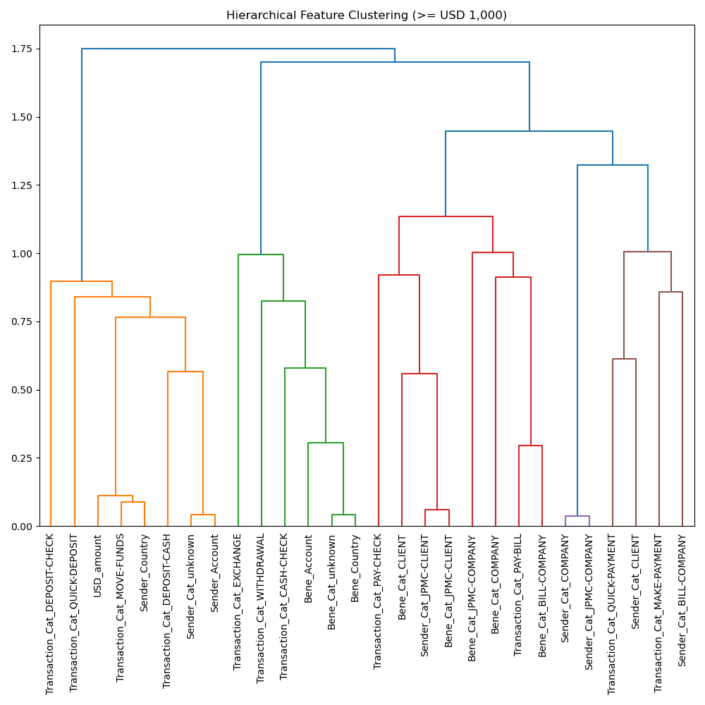
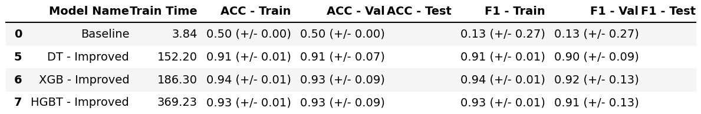
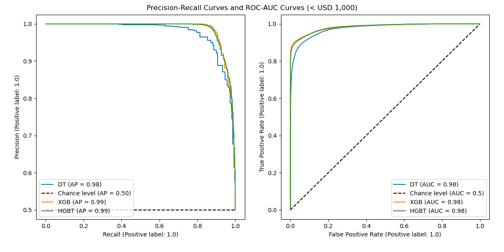
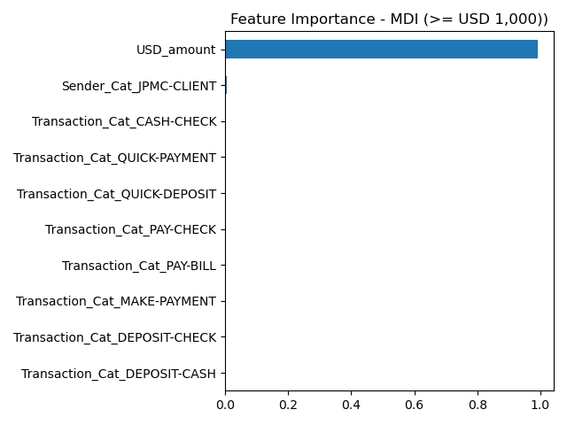
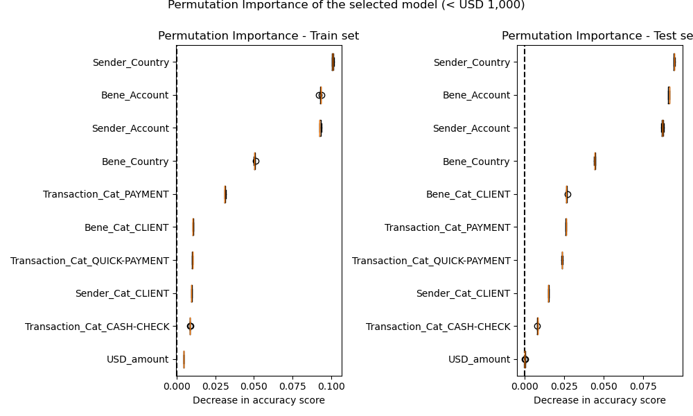

# Fraudulent Payment Detection

## 1. Business Understanding

An Online Payment Fraud study conducted by Juniper Research in 2023 forecasted USD 362 billion of total merchant losses from 2023 – 2028, with USD 91 billion losses in 2028 – an increase of more than double from USD 38 billion in 2023. The business objective of this study is to detect fraudulent payment attempts so that businesses and consumers will be better protected from financial loss due to fraudulent payment activities.

To address this business objective, the goal of this project is to build a predictive classification machine learning model which predicts whether a payment transaction is a fraudulent or legitimate payment transaction.

## 2. Executive Summary

TBD

## 3. Methodology

The Cross-Industry Standard Process for Data Mining (CRISP-DM) framework is applied to guide this effort. The framework includes six phases: business understanding, data understanding, data preparation, modelling, evaluation, and deployment.

**Phases of the CRISP-DM Process Model for Data Mining**

After understanding the business objectives, the collected data will be explored by using visualizations and probability distributions to form initial findings and hypothesis. Then, data will be cleansed and prepared to handle any integrity issues. Features will be engineered for modelling. Next, four predictive classification models will be built and fine-tuned with optimal parameters. They are **Logistic Regression (LR), Decision Trees (DT), Histogram Gradient Boosting (HGBT), and Random Forest (RF) classification models** with a cross-validation method applied. Lastly, these models or classifiers will be compared so that the best model, based on a set of predefined criteria, will be evaluated and recommended.

## 4. Data Understanding

### 4.1 Data Overview

The synthetic payment dataset was provided by an international financial institution. It describes payment information of 1,495,782 observations. The dataset contains transactional information including payment amount, senders and receivers of a large variety of payment transaction types enriched with labels representing legitimate or fraudulent payments.

Below are the attributes and descriptions of the initial data:

| **No.** | **Attribute Name** | **Attribute Description**                                                     | **Attribute Type** |
| ------- | ------------------ | ----------------------------------------------------------------------------- | ------------------ |
| 1       | Time_step          | Transaction time stamp, e.g. 2022-03-15 10:24:00                              | object             |
| 2       | Transaction_Id     | Transaction identification, e.g. EXCHANGE-10115                               | object             |
| 3       | Sender_Id          | Identification of the party who initiated the transaction, e.g. CLIENT-10098  | object             |
| 4       | Sender_Account     | Account of the of the party who initiated the transaction, e.g. ACCOUNT-10109 | object             |
| 5       | Sender_Country     | Country where the transaction was initiated, e.g. USA                         | object             |
| 6       | Sender_Sector      | Sector code of the sender                                                     | float64            |
| 7       | Sender_lob         | Sender line of business                                                       | object             |
| 8       | Bene_Id            | Identification of the party who received the transaction, e.g. CLIENT-9812    | object             |
| 9       | Bene_Account       | Account of the of the party who received the transaction, e.g. ACCOUNT-9826   | object             |
| 10      | Bene_Country       | Country where the payment made to, e.g. CANADA                                | object             |
| 11      | USD_amount         | Transaction amount, e.g. 558.43                                               | float64            |
| 12      | Transaction_Type   | Type of the transaction, e.g. WITHDRAWAL, DEPOSIT-CASH                        | object             |
| 13      | Label              | Normal or fraudulent transaction, e.g. 0: normal, 1: fraudulent               | int64              |

### 4.2 Exploratory Data Analysis

#### 4.2.1 Data Quality

**Null values:** The quality of the dataset is very decent although there are NULL values in the Sender and Receiver related categorical attributes. However, the missing information represents less than 15%. These missing values can later be dropped or imputed.

**Outliers:** Outliers present the "USA_amount"" feature and the upper fence value is USD 1,000. In addition, the dataset contains transactions with zero amount.

 

#### 4.2.2 Target Variable

The name of the target variable or column is changed from “Label” to “Fraud”.

The pie chart below illustrates that the fraudulent rate is only 2%. In other words, 98% of the total number of payment transactions are legitimate and only 2% are fraudulent observations.

However, the fraudulent rate increases with the increase of the transactional amount. When the amount is above USD 2,500 the fraudulent rate is 9%. This rate jumps to 13% with the transactional amount greater than or equal to USD 10,000. 

#### 4.2.3 Target variable and the "USD_Amount" feature

- Most payments were made with small amounts (the median value is USD 400) and there seemed to be less fraudulent activities in this range.
- For transactions at or above the upper fence amount which is USD 1,000, fraudulent loss concentrates within the range of USD 7,500 to USD 10,000.

#### 4.2.4 Target variable and the "Transaction Type" feature

- The volume of legitimate transactions is much higher than that of fraudulent transactions across all transaction types. However, the average fraudulent transaction amount is higher than the average legitimate transaction amount for all transaction types, except "Move_Funds" transaction type.

- "Make-Payment" transaction type has a much higher volume of transactions compared to other transaction types. 

- Deposits accounts for the largest fraudelent amount being led by "Deposit_Cash" followed by "Deposit_Check".

#### 4.2.5 Target variable and the Country of Sender, Beneficiary

USA is the country with the largest total transactional amount in terms of origination as well as destination. It also has the largest amount resulting from fraudulent transactions, followed by Canada and Germany.

#### 4.2.6 Identification of a Transaction, Sender, Beneficiary

- The prefixes of the "Transaction_Id", "Sender_Id", "Bene_Id" features seem to contain useful information and therefore, they were extracted for exploration. 
- The newly created "Sender_Cat" and "Bene_Cat" derived from the prefixes of the "Sender_Id" and the "Bene_Id" provide useful information about the senders and the receivers. It appears that when the sender or receiver is a "COMPANY" or a "JPMC-COMPANY", fraudulent transactions were not present.
- The newly created "Transaction_Cat" column derived from the prefix of the "Transaction_Id" is very similar to the original "Transaction_Type" column. However, it contains more categories than those of the original "Transaction_Type". Interestingly, the “Payment” category of the "Transaction_Cat" column has no fraudulent transactions. Therefore, the original "Transaction_Type" can later be replaced with the "Transaction_Cat" column or attribute.

 

#### **4.2.7 Hypothesis**

- Most transactions are below USD 1,000.
- Fraudulent rate increases with an increase of the transactional amount. 
- Although fraudulent activities are present at any transactional amount, smaller transactions tend to be more legitimate. For transactions with the amount greater than USD 1,000, fraudulent activities concentrate at the transactional amount of USD 7,500 – 10,000.
- USA is the top country in terms of total transactional amount as well as total fraudulent amount.
- Transactions with sender or beneficiary as a "Company"" or "JPMC Company" tend to be legitimate.
- Fraudulent transactions are not observed with Transaction_Ids categorized as "Payment".

## 5. Data Preparation

### 5.1 Data Cleaning and Selection

- **Removing features:** The "Time_step", Sender_lob" and "Sender_Sector"  were dropped. After the prefixes of the "Transaction_Id", "Sender_Id", "Bene_Id"" were extracted into separated columns called "Transaction_Cat", "Sender_Cat", "Bene_Cat", they were also dropped.
- **Removing duplicate observations:** After removing the above columns, particular IDs, the dataset presented 2,356 duplicate observations which were dropped.
- **Handling missing values:** Missing values were imputed as “unknown" used as one of the categories of the categorical features.
- **Handling outliers:** Outliers were detected but were not dropped. Outliers which were equal or above the upper fence amount of USD 1,000 were split into a separate dataset.
- **Datasets:** The dataset was split into a Low Amount dataset and a High Amount dataset with USD 1,000 (the upper fence amount) is the threshold.

### 5.2. Data Transformation

#### **Feature encoding:**

- **Low cardinality nominal features**: Low cardinality nominal features were encoded by using the one-hot encoding method although this method would increase the dimension of the dataset.

- **High cardinality nominal features**: Nominal categorical features with high cardinality were encoded by TargetEncoder because one-hot encoding would further inflate the feature space making it more expensive for model training.

#### **Scaling:**

Numeric features were scaled with the MinMaxScaler for Logistic Regression model. The remaining models are tree based models and are not distance based models, their input data was in its original and un-scaled form or value.

#### Balancing the datasets:

The dataset is extremely imbalanced with the minority class ("Fraud") accounts for only 2%. After the dataset was split into the train and test sets, they were balanced before training the models. Over sampling (SMOTE) was used in combination with random under sampling to balance the datasets. After balancing, the Low Amount dataset has more than 100,000 samples and the High Amount dataset has more than 50,000 samples.

### 5.3. Correlation Matrix

- **Low Amount Dataset**: Based on the correlation matrix below, there is no feature that is strongly correlated with the target variable in the Low Amount dataset. However, there are multi-collinear features.

- **High Amount Dataset**: In contrast, there are many features strongly correlated with the target variable in the High Amount dataset depicted in the heatmap below:
  

### 5.4. Feature Selection

After transformation, the dimension of the transformed dataset was close to 30. Different methods were explored to select the important transformed features in order to reduce the dimension of the transformed dataset.

##### **Handle multi-collinear features:**

Features are hierarchically clustered on the Spearman rank-order correlations. Then, 0.5 was picked as the threshold to select a single feature from each cluster.

##### Select features according to the k highest scores:

The number of features was further reduced to ten features with KBest. These features were used to train the models.

## 6. Modelling

### 6.1 Overview

Model technique and selection criteria are summarized in the table below:

| Algorithm and Selection Criteria | Low Amount Dataset                                                                                        | High Amount Dataset                                     |
| -------------------------------- | --------------------------------------------------------------------------------------------------------- | ------------------------------------------------------- |
| Model technique                  | Logistic Regression (LR), Decision Trees (DT), Histogram Gradient Boosting (HGBT), and Random Forest (RF) | Decision Trees (DT), Histogram Gradient Boosting (HGBT) |
| Performance metrics              | F0.5 and Accuracy                                                                                         | F2 and Accuracy                                         |
| Other evaluation considerations  | Speed and Ease of Interpretation                                                                          | Speed, Ease of Interpretation                           |

### 

- **Model technique:** Four classification models were built for the Low Amount Dataset. They are Logistic Regression (LR), Decision Trees (DT), Histogram Gradient Boosting (HGBT), and Random Forest (RF). These models were trained with the default parameters first for elimination. The remaining models were trained with hyper-parameter tuning. On the High Amount dataset, two models were built and hyper-parameter tuned. They are Decision Trees (DT), Histogram Gradient Boosting (HGBT).

- **Hyper-parameter tuning:** Instead of using the exhaustive and computationally expensive grid searching with GridSearchCV, randomized parameter optimization was used to tweak model performance for optimal results due to its fast speed.

- **Cross-validation:** The dataset was split into trained set and test set. When splitting the dataset, the class proportion was preserved with the “stratify” option. The test set was held out for final evaluation. Train dataset was then split into smaller sets to train, tune hyper-parameters, and validate the models as part of the stratified k-fold cross-validation method.

- **Model Selection Criteria:**
  
  - **Model performance metrics:** Model performance matrices are derived from four key components. They are:
    
                TP: true positive (the correctly predicted positive class)
    
                TN: true negative (the correctly predicted negative class)
    
                FP: false positive (the incorrectly predicted positive class)
    
                FN: false negative (the incorrectly predicted negative class)
    
    - **Accuracy**: As the dataset was balanced before model training, the conventional and intuitive Accuracy score which is calculated by the number of correct predictions divided by the total number of predictions was used for both data Low Amount and High Amount datasets.
      
              Accuracy = (Correct predictions)/(All predictions) 
      
              Accuracy = (TP + TN)/(TP + FP +TN +FN)
    
    - **Fbeta score**: Although Accuracy measurement is simple to interpret, it does not take into account the cost associated with different predictive mistakes. Fbeta score combines Precision and Recall. A model with a high Precision score might not find all the positives (“Fraud”), but the ones classified as positive by the high Precision model are almost certain to be correct. In contrast, a high Recall model would find almost all the positives, but it might incorrectly classify some negative instances (“Legit”) as positive class (“Fraud”).
      
      There is a trade-off between Precision and Recall. While we would like to have a model to correctly identify and classify a transaction as “Fraud”, we would not want to miss out on too many "Fraud" cases due to a pessimistic model. On the other hand, we would not want to take user experience lightly and hold or delay many payments because the model tries to catch all "Fraud" cases and mistakenly classify many legitimate transactions as "Fraud". 
      
      Fbeta score allows us not only to combine the two competing Precision and Recall scores but also place some weight on Precision or Recall depending on a specific scenario. Given that the fraudulent rate increases with the increase of the transactional amount, more weight was placed on Recall (beta = 2) for the High Amount dataset (e.g. we would like to catch all "Fraud" transactions when the transaction is equal or above USD 1,000 (despite the cost of false positives). In contrast, we would prioritize user experience and gave more weight to Precision (beta = 0.5) for the Low Amount dataset provided that the transactional amount is small - below USD 1,000 - and that the fraudulent rate is also low in this amount range.
      
      **F0.5 was used for the Low Amount dataset and F2 was used for the High Amount dataset** and are calculated as the following:
      
      F0.5 score = (1.25 * Precision * Recall) / (0.25*Precision + Recall)
      
      F2 score = (5 * Precision * Recall) / (4 * Precision + Recall)
      
      where
      
      Precision = (TP) / (TP + FP)
      
      Recall = (TP) / (TP + FN)
      
      In addition to the Accuracy and Fbeta scores, the confusion matrix, the precision-recall curve and ROC-AUC (Receiver Operating Characteristic – Area Under Curve) were used to further analyse and evaluate the models.

- **Other considerations:** In addition to the model performance metrics mentioned above, **speed** or train time and **ease of interpretation** (particularly to regulatory bodies) were also considered when selecting the model.

### 5.2 Train and Select Models on the Low Amount dataset

#### 5.2.1 Train and Validate on the Low Amount Train set

- **Baseline - Train:** Before the models were trained and hyper-parameter tuned on the Low Amount train set, a no-skill model was built to obtain a baseline. Our goal is to have the model which has the F0.5 score greater than 0.22% and the accuracy score greater 50%.

- **Default models - Train:** Then, four models were built with default options. The results are depicted in the table below.

The table above also indicates that the most computationally expensive model is the Random Forests (RF) model. The model built multiple deep trees which use lots of computational resources. Therefore, Random Forests (RF) was eliminated for this large dataset. 

- **Improved models - Train:** Our goal is to optimize the models so that they produce better results than those of the default models. Below are the results of the three improved models which were trained (with hyper-parameter tuning) and validated on the Low Amount train set:

LR has the lowest training and validation scores. DT and HB have similar training and validation scores with a slight better score from HB. However, the train time for HB was more than six times compared to that of DT.

#### 5.2.2 Evaluate on the Test set

- **Scoring:** The scoring table below illustrates that all three models provided very decent predictions on the Low Amount test set. HB takes the lead, followed by DT and LR. Having said, DT and HB produced very comparable results.

- **Confusion Matrix:** The confusion matrix below shows a similar picture but with more detail. LR has the highest number of misclassifications (FN + FP). The number of observations predicted correctly (TP +TN) are very similar for both classes with HB and DT. The trade-off between Precision and Recall is presented in the confusion matrix of these two models. While HB correctly classified more "Fraud" cases, it also incorrectly classified more legitimate transactions as "Fraud".

- **Precision-Recall and ROC-AUC curves:** The Precision-Recall curves and ROC-AUC curves also show that LR is trailing behind.  HB takes the lead followed by DT.

In addition, one of the considerable benefits of DT is its ease of interpretation. The model can be illustrated by a decision tree which we are all familiar with given that we create decision trees in our mind every day for many daily decisions such as where to have dinner or what to do this weekend. This is a considerable advantage when explaining how the model makes decisions with regulatory parties.

**DT was selected for its performance, speed and ease of interpretation on the Low Amount dataset.**

### 5.3 Train and Select models on the High Amount dataset

Given the result from the Low Amount dataset, two models, DT and HB models, were built for the High Amount dataset. Both provided 100% accuracy. 

**DT was selected for its performance, speed and ease of interpretation on the High Amount dataset.**

## 6. Evaluation

## 6.1 Interpretation

**Visualize the tree**

Decision Trees model allows us to visualize the decision tree to know exactly what happened inside the model and how the model made predictions. A Decision Tree diagram can be used as a flow chart to predict with input data or features. Starting at the root note, we follow the decision path and pass through interior nodes to arrive at a leaf note for the prediction. The trees for both Low Amount dataset and High Amount dataset are visualized below.

**Decision Tree of the model trained on the Low Amount dataset:**

The tree shows at each step or each node which question was asked, or which rule was used and how the answer would lead to the next step or node. The color of the boxes presents the class purity at the node: blue stands for ‘subscribed’ and orange represents ‘not subscribed’. The darker the color, the purer the class is at that node.

**Decision Tree of the model trained on the High Amount dataset:**

Each box or node provides useful information. For example, at the root node or the top box of the High Amount, the algorithm tried all the possibilities to split and determined that the split with "USD_amount \<=5,500.495" gives the lowest Gini impurity. Gini impurity is 0.5 because the number of "Legit" samples and "Fraud" samples are the same. In addition,

- There are 56,632 observations (‘samples=56,632’)
- "value = [28,316, 28,316]'' provides the repartition of these observations between two possible classes. In this case, the number of samples in each class are the same: 28,316
- ‘class = 'Legit’. This is the class predicted by the Decision Tree at the root node.

The split is also illustrated in the decision boundary below:

**Confusion Matrix - Low Amount dataset**

The above confusion matrix can be interpreted as follows:

- In the test set, there are 589 positive or “subscribed” observations and the model correctly predicted 363 instances but missed 226 positive instances.
- Of 2,430 negative instances, it correctly classified 1,473 observations and incorrectly classified 957 observations.

The scores are summarized in the classification report below:

**Confusion Matrix - High Amount dataset**

The above confusion matrix can be interpreted as follows:

- In the test set, there are 589 positive or “subscribed” observations and the model correctly predicted 363 instances but missed 226 positive instances.
- Of 2,430 negative instances, it correctly classified 1,473 observations and incorrectly classified 957 observations.

The scores are summarized in the classification report below:

### 6.2 Impurity-based importance

To identify which features are most predictive to the selected model, two techniques were used: impurity-based importance and permutation feature importance.

The selected model is a tree-based model which allows us to obtain the feature importance directly from the model based on impurity when building the tree. The higher the value, the more important is the contribution of the matching feature to the prediction function. 

The top two features influenced the model developed for the Low Amount dataset are **"Sender_Account"** and **“Transaction_Cat_PAYMENT”**.

The top two features influenced the model developed for the High Amount dataset are **"USD_Account"** and **“Sender_Cat_JPMC_CLIENT”**.

### 6.3 Permutation feature importance

The impurity-based feature importances suffer from two flaws. First they are computed from the training dataset and therefore do not necessarily inform us on which features are most important to make good predictions on held-out dataset. Secondly, they favor high cardinality features. Permutation feature importance is an alternative to impurity-based feature importance that does not suffer from these flaws. 

Permutation feature importance model inspection technique randomly shuffles a single feature value and consequently breaks the relationship between the feature and the target. The decrease in the model score indicates the level of dependency of the model to the feature and, therefore, how important the feature is to the model. Below are the results of permutation importance computed on both the train set and the test set for the selected model. The top two features are **"...”**.

The results are consistent with that of the impurity-based importance method.

Features that are important on the trained set but not on the test set might cause the model to overfit. The similarity of the feature importance ranking between those two plots, train and test, suggests that the selected model is not overfit.

## 7. Conclusion and Recommendations

To identify a predictive classification model, seven features related to the bank client information of the Portuguese bank direct marketing dataset was explored and transformed. Four models named K-nearest Neighbors (KNN), Logistic Regression (LR), Decision Trees (DT), and Support Vector Machines (SVM) classification models were built and validated. These models were evaluated with a set of pre-defined criteria. They are **speed, ease of interpretation and performance metrics (F1 and Balanced Accuracy)**. The model with the highest quality, **Decision Trees**, was selected and inspected. The top two features that influenced the selected model the most are **default_no** (e.g. the client is not in a credit default status) and **loan_no** (e.g. the client does not have a personal loan).

**Next steps:**

The project can be continued by further optimizing the performance of the model. Some examples are using all features of the original dataset and/or balancing the dataset before training the model.

## 8. Jupyter Notebook

Please refer to the [Direct Marketing Jupiter Notebook](https://github.com/TLe2023/DirectMarketing/blob/main/Bank_Direct_Marketing_7_features_Final.ipynb) for more information.
