# Fraudulent Payment Detection

## 1. Business Understanding

An Online Payment Fraud study conducted by Juniper Research in 2023 forecasted USD 362 billion of total merchant losses from 2023 – 2028, with USD 91 billion losses in 2028 – an increase of more than double from USD 38 billion in 2023. The business objective of this study is to detect fraudulent payment attempts so that businesses and consumers will be better protected from financial loss due to fraudulent payment activities.

To address this business objective, the goal of this project is to build a predictive classification machine learning model(s) which effectively predicts whether a payment transaction is a fraudulent or legitimate payment transaction.

## 2. Executive Summary

This publication includes or references synthetic data provided by J.P. Morgan. Exploratory data analysis suggested that the fraudulent rate increases with the increase of the transaction amount. The original large and imbalanced dataset was split into two datasets, a **Low Amount dataset**, and a **High Amount dataset**, with **USD 1,000** - as the threshold between the two datasets; this allows for different strategies of model training and evaluation for each dataset.

Each dataset was balanced to have the same number of fraudulant and non-fraudulant samples before training the models. Accuracy was used to measure the performance of the models trained in both Low and High Amount datasets. In addition, F1 score (a balance of Precision and Recall) was applied to the Low Amount dataset while F2 score (more weight was placed on Recall) was used to measure the performance of the models trained on the High Amount dataset. Additional measurements and criteria such as ROC-AUC (receiver operating characteristic – area under curve), AP (average precision), speed and interpretability were considered when evaluating the models.

On the **Low Amount** dataset, **eXtreme Gradient Boosting (XGB)** was selected based on its speed, performance and its acceptable interpretability. It achieved **92% Accuracy score, 92% F1 score, 98% ROC-AUC score** and **98% AP score**. 

On the **High Amount** dataset, **Decision Trees (DT)** was selected with **perfect scores** of **100% for Accuracy, F2, ROC-AUC and AP**.

## 3. Methodology

The Cross-Industry Standard Process for Data Mining (CRISP-DM) framework is applied to guide this effort. The framework includes six phases: business understanding, data understanding, data preparation, modelling, evaluation, and deployment.

**Phases of the CRISP-DM Process Model for Data Mining**

After understanding the business objectives, the collected data was explored by using visualizations and probability distributions to form initial findings and hypotheses. Then, the data was cleansed and prepared to handle any integrity issues. Features were engineered for modelling. Next, the dataset was split into a Low Amount dataset and a High Amount dataset. Four predictive classification models were built with default parameters with a cross-validation method applied on the Low Amount dataset. They were **Decision Trees (DT), Histogram Gradient Boosting (HGBT), eXtreme Gradient Boosting (XGB), and AdaBoost (AB)** classification models. Two models, **Decision Trees (DT) and Logistic Regression (LR)**, were built on the High Amount dataset. After eliminating one model on Low Amount dataset, the remaining three models were fine-tuned with optimal parameters. Lastly, these models or classifiers were compared so that the best model, based on a set of predefined criteria, would be evaluated and recommended.

## 4. Data Understanding

### 4.1 Data Overview

The synthetic payment dataset was provided by an international financial institution -J.P. Morgan. It describes payment information of 1,495,782 observations. The dataset contains transactional information including payment amount, senders and receivers of a large variety of payment transaction types enriched with labels representing legitimate or fraudulent payments.

Below are the attributes and descriptions of the initial data:

| **No.** | **Attribute Name** | **Attribute Description**                                                     | **Attribute Type** |
| ------- | ------------------ | ----------------------------------------------------------------------------- | ------------------ |
| 1       | Time_step          | Transaction time stamp, e.g. 2022-03-15 10:24:00                              | object             |
| 2       | Transaction_Id     | Transaction identification, e.g. EXCHANGE-10115                               | object             |
| 3       | Sender_Id          | Identification of the party who initiated the transaction, e.g. CLIENT-10098  | object             |
| 4       | Sender_Account     | Account of the of the party who initiated the transaction, e.g. ACCOUNT-10109 | object             |
| 5       | Sender_Country     | Country where the transaction was initiated, e.g. USA                         | object             |
| 6       | Sender_Sector      | Sector code of the sender                                                     | float64            |
| 7       | Sender_lob         | Sender line of business                                                       | object             |
| 8       | Bene_Id            | Identification of the party who received the transaction, e.g. CLIENT-9812    | object             |
| 9       | Bene_Account       | Account of the of the party who received the transaction, e.g. ACCOUNT-9826   | object             |
| 10      | Bene_Country       | Country where the payment made to, e.g. CANADA                                | object             |
| 11      | USD_amount         | Transaction amount, e.g. 558.43                                               | float64            |
| 12      | Transaction_Type   | Type of the transaction, e.g. WITHDRAWAL, DEPOSIT-CASH                        | object             |
| 13      | Label              | Normal or fraudulent transaction, e.g. 0: normal, 1: fraudulent               | int64              |

### 4.2 Exploratory Data Analysis

#### 4.2.1 Data Quality

**Null values:** The quality of the dataset is very decent although there are NULL values in the Sender and Receiver related categorical attributes. The missing information represents less than 15% and were imputed instead of being dropped.

**Outliers:** Outliers present in the "USA_amount" feature and the upper fence value is USD 1,000. In addition, the dataset contains transactions with zero amount.

 

#### 4.2.2 Target Variable

The name of the target variable or column is changed from “Label” to “Fraud”.

The pie chart below illustrates that the fraudulent rate is only 2%. In other words, 98% of the total number of payment transactions are legitimate and only 2% are fraudulent observations.

However, the fraudulent rate increases with the increase of the transactional amount. When the amount is above USD 2,500 the fraudulent rate is 9%. This rate jumps to 13% with the transactional amount greater than or equal to USD 10,000. 

#### 4.2.3 Target variable and the "USD_Amount" feature

- Most payments were made with lesser amounts (the median value was USD 400) and there seemed to be less fraudulent activities in this range.
- For transactions at or above the upper fence amount which is USD 1,000, fraudulent loss concentrates within the range of USD 7,500 to USD 10,000.

#### 4.2.4 Target variable and the "Transaction Type" feature

- The volume of legitimate transactions is much higher than that of fraudulent transactions across all transaction types. However, the average fraudulent transaction amount is higher than the average legitimate transaction amount for all transaction types, except "Move_Funds" transaction type.

- "Make-Payment" transaction type has a much higher volume of transactions compared to other transaction types. 

- Deposits account for the largest fraudulent amount being led by "Deposit_Cash" followed by "Deposit_Check".

#### 4.2.5 Target variable and the Country of Sender, Beneficiary

USA is the country with the largest total transactional amount in terms of origination as well as destination. It also has the largest amount resulting from fraudulent transactions, followed by Canada and Germany.

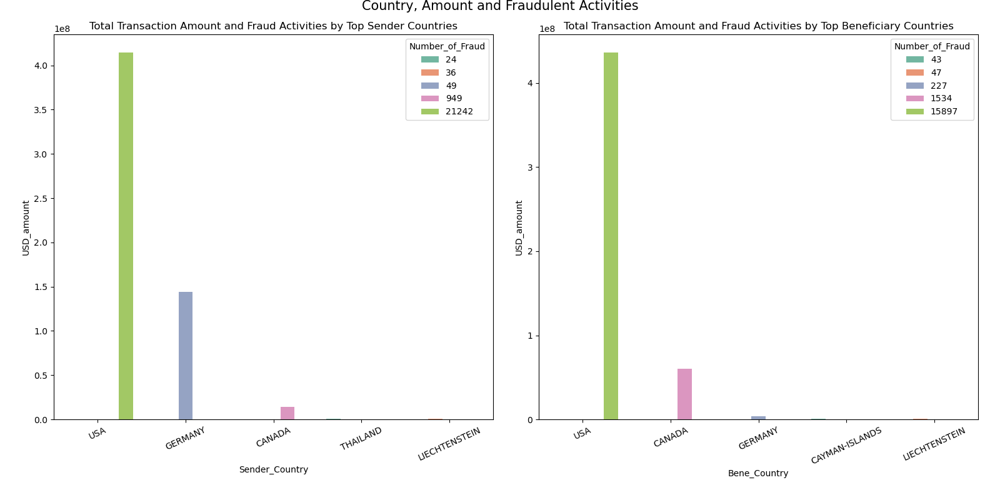

#### 4.2.6 Identification of a Transaction, Sender, Beneficiary

- The prefixes of the "Transaction_Id", "Sender_Id", "Bene_Id" features seem to contain useful information and therefore, they were extracted for exploration. 
- While the prefixes of the "Sender_Account" and the "Bene_Account" are not informative, the newly created "Sender_Cat" and "Bene_Cat" derived from the prefixes of the "Sender_Id" and the "Bene_Id" provide useful information about the senders and the receivers. It appears that when the sender or receiver is a "COMPANY" or a "JPMC-COMPANY", fraudulent transactions were not present.
- The newly created "Transaction_Cat" column derived from the prefix of the "Transaction_Id" is remarkably similar to the original "Transaction_Type" column. However, it contains more categories than those of the original "Transaction_Type". Interestingly, the “PAYMENT” category of the "Transaction_Cat" column has no fraudulent transactions. Therefore, the original "Transaction_Type" can later be replaced with the "Transaction_Cat" column or attribute.

 

#### **4.2.7 Hypothesis**

- Most transactions are below USD 1,000.
- Although fraudulent activities are present at any transactional amount, smaller transactions tend to be more legitimate. The fraudulent rate increases with an increase of the transactional amount. For transactions with the amount greater than USD 1,000, fraudulent activities concentrate at the transactional amount of USD 7,500 – 10,000.
- USA is the top country in terms of total transactional amount as well as total fraudulent amount.
- Transactions with sender or beneficiary as a "Company" or "JPMC Company" tend to be legitimate.
- Fraudulent transactions are not observed with Transaction_Ids categorized as "Payment".

## 5. Data Preparation

### 5.1 Data Cleaning and Selection

- **Removing features:** The "Time_step", Sender_lob" and "Sender_Sector"  were dropped. After the prefixes of the "Transaction_Id", "Sender_Id", "Bene_Id"" were extracted into separated columns called "Transaction_Cat", "Sender_Cat", "Bene_Cat", they were also dropped.
- **Removing duplicate observations:** After removing the above columns, particular IDs, the dataset presented 2,356 duplicate observations which were dropped.
- **Handling missing values:** Missing values were imputed as “unknown" and used as one of the categories of the categorical features.
- **Handling outliers:** Outliers were detected but were not dropped. Outliers which were equal to or above the upper fence amount of USD 1,000 were split into a separate dataset.
- **Datasets:** The dataset was split into a Low Amount dataset and a High Amount dataset with USD 1,000 (the upper fence amount) is the threshold. The split will allow employing different strategies to detect fraudulent attempts for each dataset.

### 5.2. Data Transformation

#### **Feature encoding:**

- **Low cardinality nominal features**: Low cardinality nominal features were encoded by using the one-hot encoding method although this method would increase the dimension of the dataset. They are 'Transaction_Cat', 'Sender_Cat', and 'Bene_Cat'.

- **High cardinality nominal features**: Nominal categorical features with high cardinality were encoded by TargetEncoder because one-hot encoding would further inflate the feature space making it more expensive for model training. They are 'Sender_Country', 'Bene_Country', 'Sender_Account', and 'Bene_Account'. 

#### **Scaling:**

Numeric features were scaled with the MinMaxScaler for Logistic Regression model. The remaining models are tree-based models and are not distance based models, their input data was in its original and un-scaled form or value.

#### Balancing the datasets:

The dataset is extremely imbalanced with the minority class ("Fraud") accounts for only 2%. After the dataset was split into the train and test sets, they were balanced before training the models. Over sampling (SMOTE) was used in combination with random under sampling to balance the datasets. After balancing, the Low Amount dataset has more than 600,000 samples and the High Amount dataset has more than 100,000 samples.

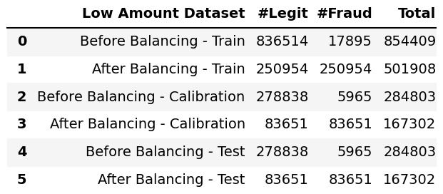

### 5.3. Correlation Matrix

- **Low Amount Dataset**: Based on the correlation matrix below, there is no feature that is strongly correlated with the target variable in the Low Amount dataset. However, there are multi-collinear features. For example, Bene_Cat_JPMC_Client is strongly and negatively correlated with Sender_Cat_JPMC_Client.

**High Amount Dataset**: In contrast, there are many features strongly, positively correlated with the target variable in the High Amount dataset depicted in the heatmap below. The top four features are USD_amount, Transaction_Cat_MOVE-FUNDS,
Sender_Country, Sender_Cat_JPMC-CLIENT.

### 5.4. Feature Selection

After transformation, the dimension of the transformed dataset was close to 30. Different methods were explored to select the important transformed features in order to reduce the dimension of the transformed dataset.

##### **Handle multi-collinear features:**

Features are hierarchically clustered on the Spearman rank-order correlations. Then, a threshold was picked to select a single feature from each cluster.

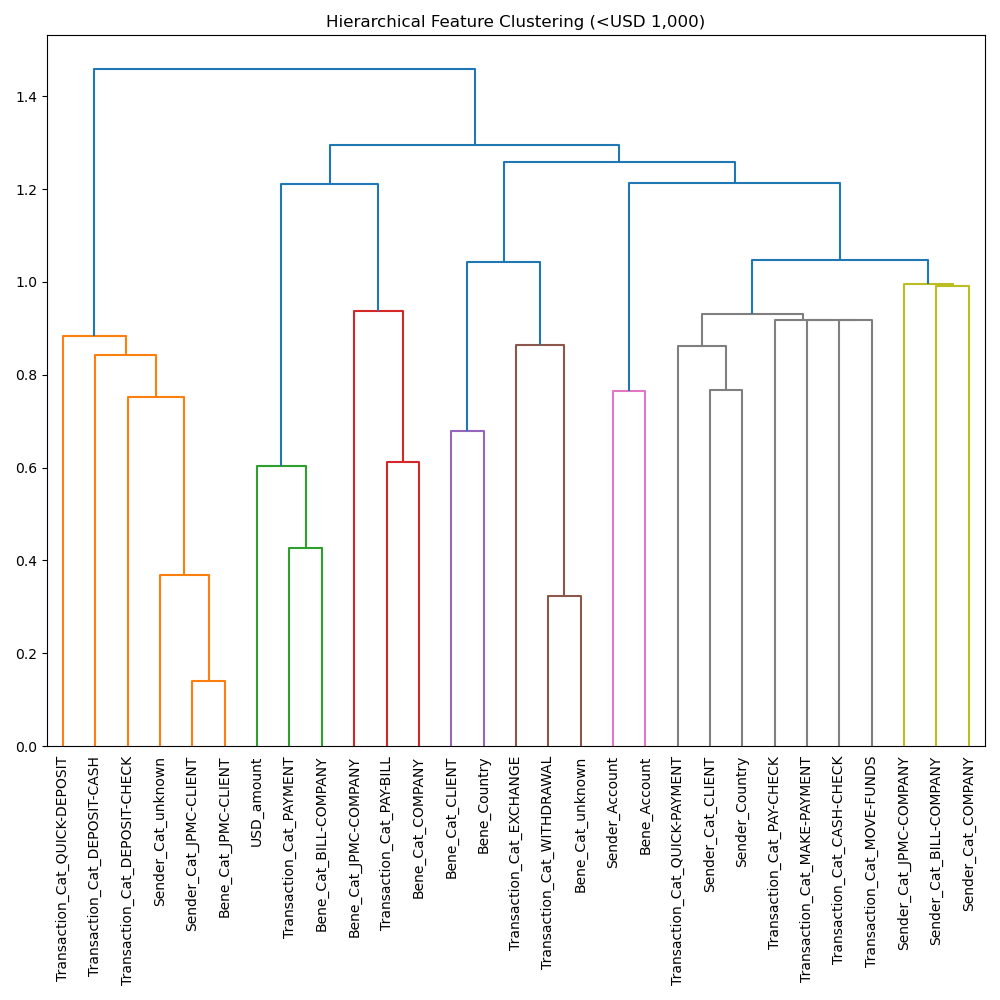

##### Select features according to the k highest scores:

The number of features was further reduced to ten features with KBest. These features were used to train the models.

## 6. Modelling

### 6.1 Selection Criteria

- **Model performance metrices:** Model performance matrices are derived from four key components. They are:
  
              TP: true positive (the correctly predicted positive class - "Fraud")
  
              TN: true negative (the correctly predicted negative class - "Legit")
  
              FP: false positive (the incorrectly predicted positive class - "Fraud")
  
              FN: false negative (the incorrectly predicted negative class - "Legit")
  
  - **Accuracy**: As the dataset was balanced before model training, the conventional and intuitive Accuracy score, which is calculated by the number of correct predictions divided by the total number of predictions, was used for both Low Amount and High Amount datasets. Models were trained with a focus on Accuracy.
    
            Accuracy = (Correct predictions)/(All predictions)
    
            Accuracy = (TP + TN)/(TP + FP +TN +FN)
  
  - **Fbeta score**: Although Accuracy measurement is simple to interpret, it does not take into account the cost associated with different predictive mistakes. Fbeta score combines Precision and Recall. A model with a high Precision score might not find all the positives (“Fraud”), but the ones classified as positive by the high Precision model are almost certain to be correct. In contrast, a high Recall model would find almost all the positives, but it might incorrectly classify some negative instances (“Legit”) as positive class (“Fraud”).
    
    There is a trade-off between Precision and Recall. While we would like to have a model to correctly identify and classify a transaction as “Fraud”, we would not want to miss out on too many "Fraud" cases due to a pessimistic model. On the other hand, we would not want to take user experience lightly and hold or delay many payments because the model tries to catch all "Fraud" cases and mistakenly classifies many legitimate transactions as "Fraud".
    
    Fbeta score allows us not only to combine the two competing Precision and Recall scores but also place some weight on Precision or Recall depending on a specific scenario. Given that the fraudulent rate increases with the increase of the transactional amount, more weight was placed on Recall (beta = 2) for the High Amount dataset (e.g. we would like to catch all "Fraud" transactions when the transaction is equal or above USD 1,000 - despite the cost of false positives). In contrast, we would not want to take the user experience lightly and would balance Precision and Recall (beta = 1) for the Low Amount dataset.
    
    **F1 measure was used for the Low Amount dataset and F2 measure was used for the High Amount dataset**. They are calculated as the following:
    
    F1 score = (2 * Precision * Recall) / (Precision + Recall)
    
    F2 score = (5 * Precision * Recall) / (4 * Precision + Recall)
    
    where
    
    Precision = (TP) / (TP + FP)
    
    Recall = (TP) / (TP + FN)
    
    In addition to the Accuracy and Fbeta scores, the **confusion matrix, the precision-recall curve (average prevision score) and ROC-AUC (receiver operating characteristic – area under curve)** were used to further analyse and evaluate the models.

- **Other considerations:** In addition to the model performance metrics mentioned above, **speed** or train time and **ease of interpretation** (particularly to regulatory bodies) were also considered when selecting the model.

### 6.2 Technique

Model algorithm and selection criteria are summarized in the table below:

| Algorithm and Selection Criteria | Low Amount Dataset                                                                                          | High Amount Dataset                               |
| -------------------------------- | ----------------------------------------------------------------------------------------------------------- | ------------------------------------------------- |
| Model Algorithm                  | Decision Trees (DT), Extreme Gradient Boosting (XGB), Histogram Gradient Boosting (HGBT), and AdaBoost (AB) | Decision Trees (DT), and Logistic Regression (LR) |
| Performance metrics              | Accuracy and F1                                                                                             | Accuracy and F2                                   |
| Other evaluation considerations  | Speed and Ease of Interpretation                                                                            | Speed and Ease of Interpretation                  |

- **Model Algorithm:** 
  
  - **Low Amount dataset**: As there are no features strongly or moderately correlated with the target variable in the Low Amount dataset which has approximately 500,000 samples on the train set, the popular Random Forests (RF) – a bagging ensemble model - is not used. In addition, RF builds multiple deep trees which use lots of computational resources. Four classification models were built for the Low Amount Dataset. They are Decision Trees (DT) and three tree-based boosting ensembles: eXtreme Gradient Boosting (XGB), Histogram Gradient Boosting (HGBT), and AdaBoost (AB). These four models were trained with the default parameters first for elimination. The remaining models were trained with hyper-parameter tuning. 
  
  - **High Amount dataset**: The High Amount dataset has features strongly or moderately correlated with the target variable and has approximately 100,000 samples. Two models were built and hyper-parameter tuned on this dataset. They are Decision Trees (DT) and Logistic Regression (LR).

- **Hyper-parameter tuning:** Instead of using the exhaustive and computationally expensive grid searching with GridSearchCV, randomized parameter optimization was used to tweak model performance for optimal results due to its fast speed.

- **Cross-validation:** The dataset was split into trained set and test set. When splitting the dataset, the class proportion was preserved with the “stratify” option. The test set was held out for final evaluation. Train dataset was then split into smaller sets to train, tune hyper-parameters, and validate the models as part of the stratified k-fold cross-validation method.

### 6.2 Train and Select Models on the Low Amount dataset

#### 6.2.1 Train and Validate on the Low Amount Train Set

- **Baseline - Train:** Before the models were trained and hyper-parameter tuned on the Low Amount train set, a no-skill model was built to obtain a baseline. Our goal is to have the model which has the accuracy score greater 50% and the F1 score greater than 27%.

- **Default models - Train:** The below models were built with default options and the results are depicted in the table below. AB provides the lowest score and is the slowest model in terms of training time. It was eliminated. DT has a very decent score but it is slower than XGB and HGBT because it built a very deep tree - more than 60 in depth.

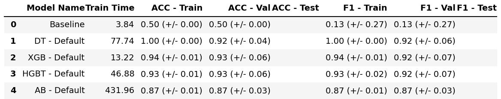

- **Improved models - Train:** Our goal of hyper-parameter tuning is not to beat the above scores of the default models (although it could happen) but rather to balance variance and bias or, in other words, to balance the model complexity and its predictive performance. Below are the results of the three improved models which were trained (with hyper-parameter tuning) and validated on the Low Amount train set. XGB takes the lead on the scores, followed by HGBT and then DT. However, it takes more time to arrive at the optimal hyper-parameters for XGB and HGBT compared to DT.

- **Fit and score time curves:** Using the model improved with hyper-parameter tuning above, the curves of fit time and score time were plotted. The trend lines below suggest that XGB is the best in terms of scalability. The fit time of DT increases exponentially when the number of samples is over 100,000.
  

- **Learning curves**: Given that the original dataset has 1.5 million observations, one question is whether the models would benefit from adding more samples. The learning curves below illustrate that training scores and validation scores converged at about 300,000 samples. Therefore, there would not be much beneficial to add more samples.
  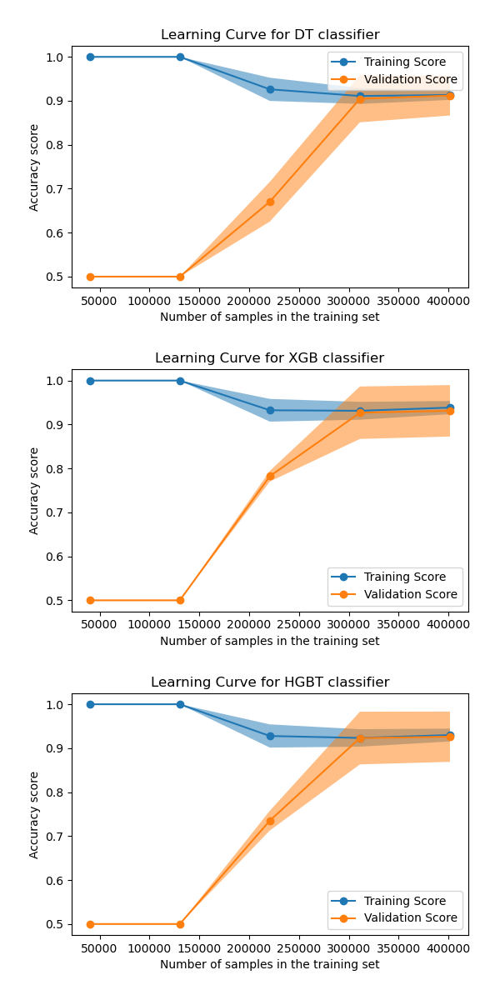
  
  #### 6.2.2 Evaluate on the Low Amount Test Set

- **Scoring:** The scoring table below illustrates that all three models provided very decent predictions on the Low Amount test set. XGB and HGBT take the lead in terms of performance, followed by DT.

- **Confusion Matrix:** DT has the highest number of false positives (FP) and the lowest number of false negatives (FN). The confusion matrices of the XGB and HBGT models are alike. However, they present the trade-off between Precision and Recall. While HGBT has the lower number of FN, its FP is higher than that of XGB and higher FP impacts user experience. In other words, HGBT correctly classified more "Fraud" cases, it also incorrectly classified more legitimate transactions as "Fraud".

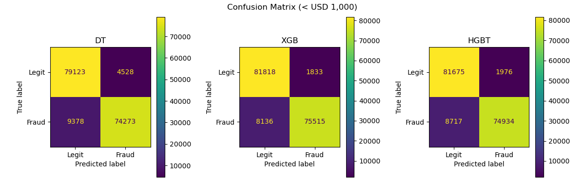

- **Precision-Recall and ROC-AUC curves:** The Precision-Recall curves and ROC-AUC curves show that DT is trailing behind.  XGB and HGBT are very similar.

One of the considerable benefits of DT is its ease of interpretation. DT has one decision tree which can be visualized. The decision tree is familiar to all of us given that we create decision trees in our mind every day for many daily decisions such as where to have dinner or what to do this weekend. However, the DT model in this case has a very deep tree structure although it was reduced from more than 60 to below 20 in depth and sacrificed some predictive performance with hyper-parameter tuning. Still, a decision tree with approximately 20 in depth is hard to read.

XGB and HGBT are ensembles, and it requires a little more effort to interpret the models. Having said that, they are tree-based ensembles which have multiple decision trees. In addition, XGB has the built-in model feature importance while HGBT lacks this function. XGB also has built-in features to plot the decision trees. That makes its interpretability acceptable when explaining how the model makes decisions to stakeholders, particularly regulatory parties.

**XGB was selected for its performance, acceptable speed and interpretability on the Low Amount dataset.**

### 6.3 Train and Select models on the High Amount dataset

Given the nature of the High Amount dataset (e.g. the presence of strongly correlated relationships) , two models, DT and LR models, were built for the High Amount dataset. **Both models achieved 100% accuracy**. 

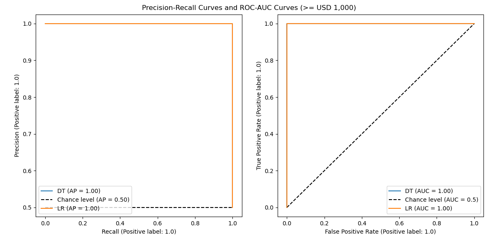

However, the confusion matrix indicates that LR incorrectly classified seven instances. They are legitimate transactions but were incorrectly classified as fraudulent transactions.

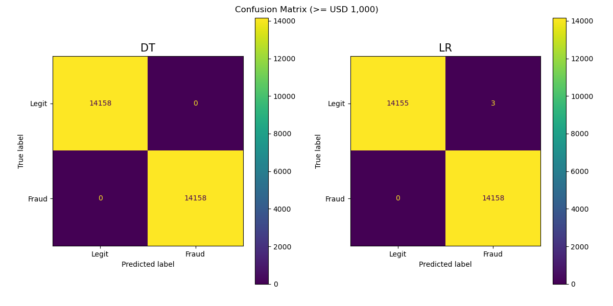

**DT was selected for its performance, speed and ease of interpretation on the High Amount dataset.**

## 7. Evaluation and Interpretation

## 7.1 Visualize the decision tree

**Decision Tree of the DT model trained on the High Amount dataset**

Decision Trees model allows us to visualize the decision tree to know exactly what happened inside the model and how the model made predictions. A Decision Tree diagram can be used as a flow chart to predict with input data or features. Starting at the root note, we follow the decision path and pass through interior nodes to arrive at a leaf note for the prediction. The tree for the High Amount dataset is visualized below.

**Decision Tree of the DT model trained on the High Amount dataset:**

The tree shows at each step or each node which question was asked, or which rule was used and how the answer would lead to the next step or node. The color of the boxes presents the class purity at the node: blue stands for ‘Fraud’ and orange represents ‘Legit’. The darker the color, the purer the class is at that node. In the tree of the model trained on the High Amount dataset below, the root node is white because it is a tie node - the number of "Legit" samples and "Fraud" samples are the same.

Each box or node provides useful information. For example, at the root node or the top box of tree trained on the High Amount dataset, the algorithm tried all the possibilities to split and determined that the split with "USD_amount \<=5,500.495" is an optimum split which gives the highest information gain or the lowest uncertainty measured by Entropy. The highest Entropy value is 1 and the lowest value is 0. The tree starts at the root node with Entropy = 1 as there is lots of uncertainty at this beginning point. As we travel down the tree, the Entropy reduces in values as more information gain and less uncertainty. Our goal is to reach 0 Entropy which means the node is pure. In addition,

- There are 113,264 observations (‘samples=113264’) at the root node as we have 113,264 observations in the test set.
- "value =  [56632, 56632]'' provides the partition of these observations between two possible classes. In this case, the number of samples in each class are the same: 56,632
- ‘class = 'Legit’. This is the class predicted by the Decision Tree at the root node.

The split is also illustrated in the decision boundary below:

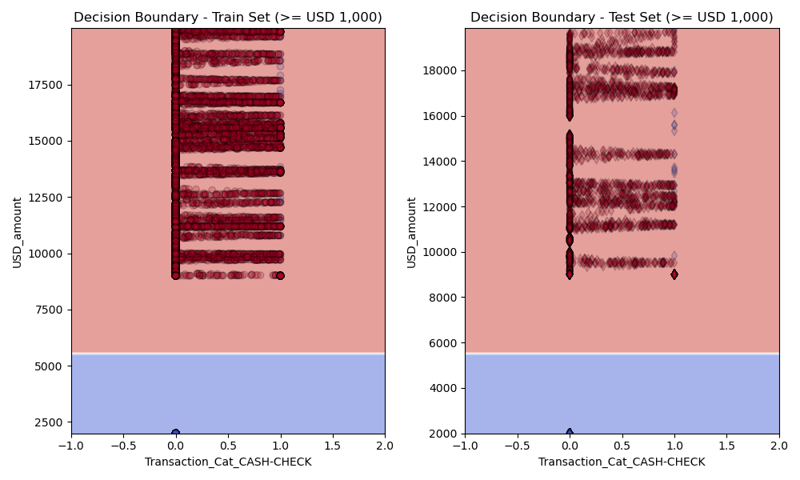

**Decision Trees of the XGB model trained on the Low Amount dataset**

XGB is a tree-based ensemble which is a technique leveraging the "The Wisdom of the Crowd" combining multiple decision trees, which is like the above tree, to produce an optimal outcome. In our case, the XGB model built 100 decision trees, which are called weak-base-learners, with the tree depth limited to 7. The model built each tree sequentially. Each tree was added one at a time to the ensemble and the objective is to correct the predictive errors made by prior trees. Below is the visualization of the last and first decision trees in the ensemble:

**Decision Tree - member #99  or the last tree in the ensemble**

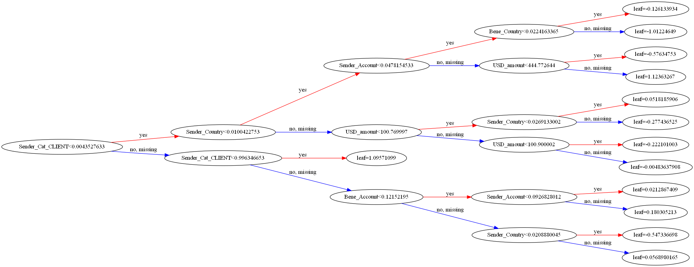

**Decision Tree - member #0 or the first tree in the ensemble**

## 

The key difference between the tree in the XGB ensemble of the Low Amount dataset and the single tree of the High Amount dataset is that the leaf of the XGB tree only contains decision values. These values represent the conditional probabilities of the data belonging to the positive class ("Fraud") and can be negative (0 means 50% chance). The leaf values in each tree of the ensemble will then be aggregated (and transformed) by the model for the final prediction.

## 7.2 Confusion Matrix

**Confusion Matrix - Low Amount dataset**

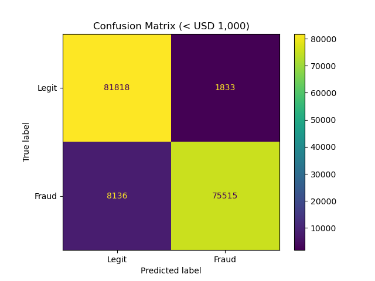

The above confusion matrix can be interpreted as follows:

- In the test set, there are 61,344 positive or "Fraud” observations and the model correctly predicted 55,672 instances but missed 5,672 positive instances.
- Of 61,344 negative or "Legit" instances, it correctly classified 57,481 observations and incorrectly classified 3,863 observations.
- The Precision, Recall, F1 scores are summarized below 
  

**Confusion Matrix - High Amount dataset**

The above confusion matrix shows that the model correctly classified all instances in the test set. The scores are summarized in the classification report below:

## 7.3 Feature Importance

To identify which features are most predictive to the selected model, two techniques were used: built-in model feature importance and permutation feature importance.

**DT Feature Importance - High Amount dataset**

The selected model of the High Amount dataset is a tree-based model which allows us to obtain the feature importance directly from the model based on impurity when building the tree. The higher the value, the more important is the contribution of the matching feature to the prediction function. 

The top two features influenced the model developed for the High Amount dataset are **"USD_Account"** and **“Sender_Cat_JPMC_CLIENT”**.

**XGB Feature Importance - Low Amount dataset**

The selected model of the Low Amount dataset is an ensemble with a tree-based estimator. It also allows us to obtain the feature importance directly from the model. There are five types of importance. The features influenced the model, calculated by each important type, are plotted below.

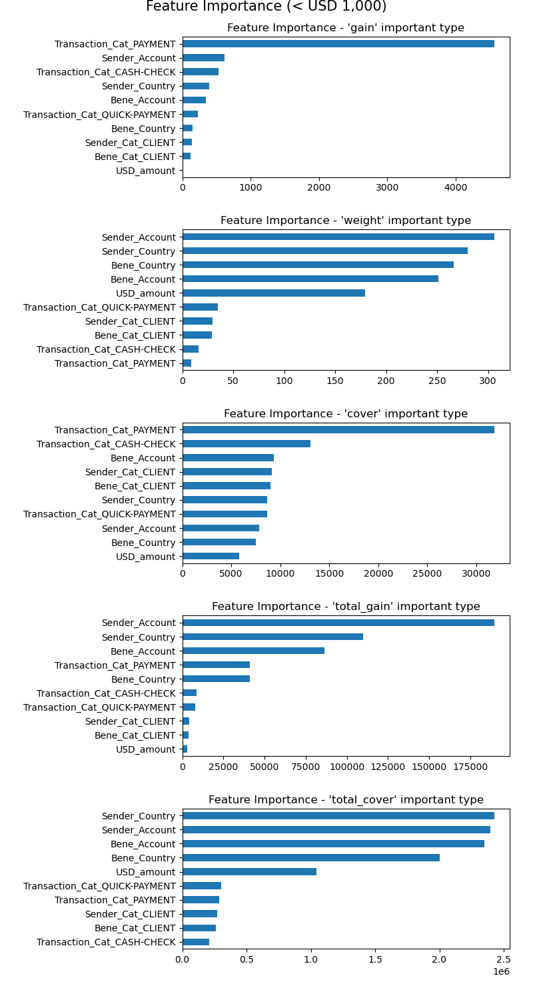

### 7.4 Permutation feature importance

The impurity-based feature importances computed from the training dataset and therefore do not necessarily inform us on which features are most important to make good predictions on held-out dataset. Permutation feature importance is an alternative to impurity-based feature importance that does not suffer from this flaw. 

Permutation feature importance model inspection technique randomly shuffles a single feature value and consequently breaks the relationship between the feature and the target. The decrease in the model score indicates the level of dependency of the model to the feature and, therefore, how important the feature is to the model. 

**DT permutation feature importance - High Amount dataset:**

Below are the results of permutation importance computed on both the train set and the test set of the the High Amount dataset for the selected model. The two three features are **"USD_amount”** and **"Sender_Cat_JPMC_Client"**. The results are consistent with that of the impurity feature importance method.

Features that are important on the trained set but not on the test set might cause the model to overfit. The similarity of the feature importance ranking between those two plots, train and test, suggests that the selected model is not overfit.

**XGB permutation feature importance - Low Amount dataset:**

Below are the results of permutation importance computed on both the train set and the test set for the selected model. The top three features are **"Sender_Account”** and **"Bene_Account"** and **"Sender_Country"**. The results are consistent with that of the "Total Gain" model feature importance method.

## 7. Conclusion and Recommendations

To detect fraudulent attempts, this publication includes or references synthetic data provided by J.P. Morgan. The dataset with approximately 1.5 million observations was explored and split into a Low Amount dataset (below USD 1,000) and a High Amount dataset (at or above USD 1,000). The two datasets were transformed and balanced before training multiple models for selection. These models were evaluated with a set of pre-defined selection criteria. They are **speed, ease of interpretation and performance metrics (Accuracy, F-measure, AP and ROC-AUC)**.

On the balanced Low Amount dataset, **XGB** was selected. It achieve  **92% Accuracy, 92% of F1 and 98% of AP and ROC-AUC**. The top three features influenced the model are t**he account and the country of the Sender** ( "Sender_Account”, "Sender_Country" atributes) and **account of the beneficiary** ("Bene_Account" attribute)

On the High Amount dataset, **DT** was selected with a perfect score of **100% Accuracy, F2, AP and ROC-AUC**. The top two features that influenced the selected model the most are the **transactional amount** ("USD_amount” attribute) and the **JPMC Client type of client** ("Sender_Cat_JPMC_Client" attribute).

**Next steps:**

The project can be continued by implementing the last step of CRISP-DM which is deployment. The trained eXtreme Gradient Boosting (XGB) model or Decision Trees (DT) model could be used to detect fraudulent attempts depending on whether the transactional amount is below USD 1,000 or greater, equal to USD 1,000. In addition, a business process could be developed to handle transactions that are detected and flagged as fraudulent transactions by the models. 

## 8. Jupyter Notebook

Please refer to the [Payment Fraud Detection Jupiter Notebook](https://github.com/TLe2023/DirectMarketing/blob/main/Bank_Direct_Marketing_7_features_Final.ipynb) for more information.
